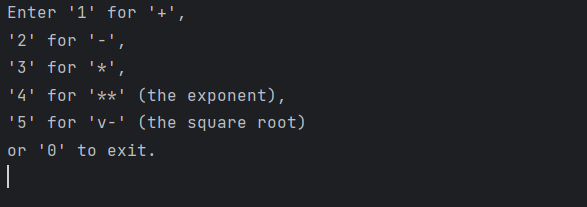
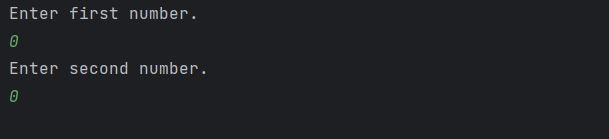
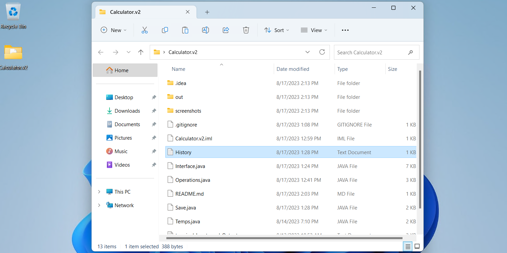
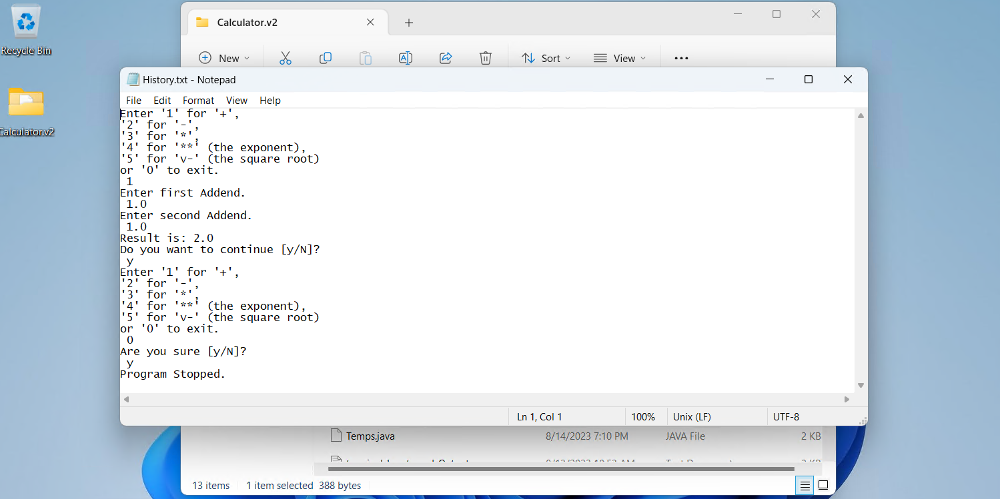

# Calculator

A calculator Java application that runs on the terminal.

## Screenshots
|                Appearance In the Terminal                 |
:------------------------------------------------:|
 

While running, the user is given instructions for performing simple math operations or exiting the app as shown in the image above.

If a mathematical operation is selected, then two numbers must be given each time to perform an operation. 

|                Number Input                 |
:------------------------------------------------:|
 

Then, the result is printed and the process is repeated until the user gives "0" in the command section.
On exit, the history is saved in a History.txt file in the project's directory.

|                                  |                                  |            
:------------------------------------------------:|:------------------------------------------------:
      |  

(Note: The square root operation only calculates for natural numbers, whose root is also a natural number.)

